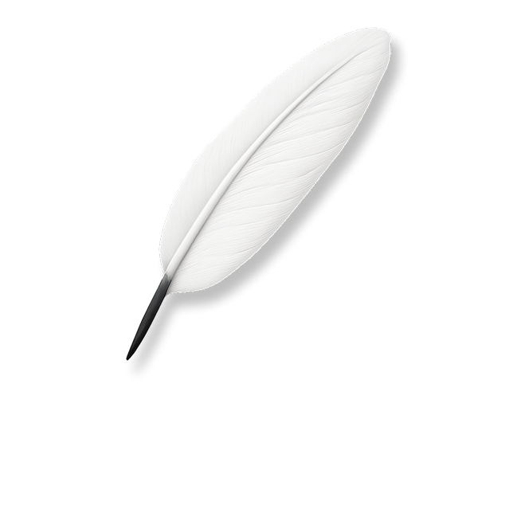

# 

<div align="center">
  
</div>

<div align="center">
  <strong>A free speech platform, all on-chain.</strong>
</div>

<br>

## About

Chatr is building the future of a decentralized community square where free speech thrives on the blockchain. Built with modern web technologies and designed for transparency, security, and user empowerment.

## Tech Stack

- **Framework:** Next.js 14
- **Language:** TypeScript
- **Styling:** Tailwind CSS
- **UI Components:** Radix UI
- **Theme:** Dark/Light mode support
- **Deployment:** Vercel-ready

## Getting Started

1. **Install dependencies**
   ```bash
   npm install
   ```

2. **Run the development server**
   ```bash
   npm run dev
   ```

3. **Open your browser**
   ```
   http://localhost:3000
   ```

## Features

- 🌙 Dynamic theme switching (light/dark)
- 📱 Fully responsive design
- ⚡ Optimized performance with Next.js

## Contributing

We welcome contributions to help build the future of decentralized communication.

## License

All rights reserved - The Social Proof Foundation, LLC.